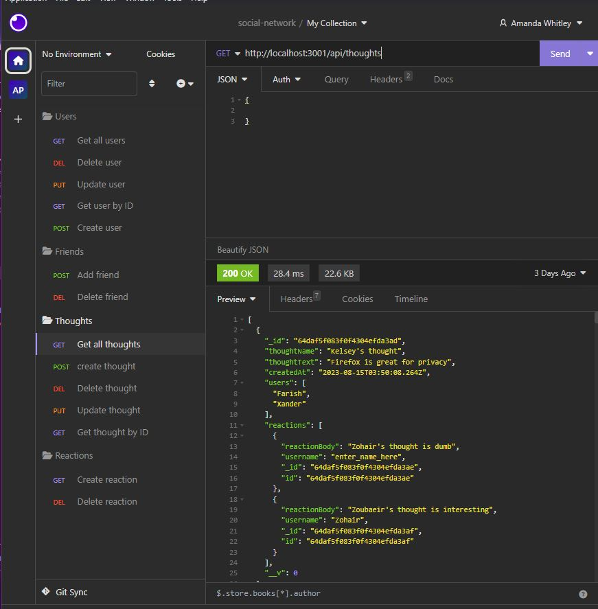
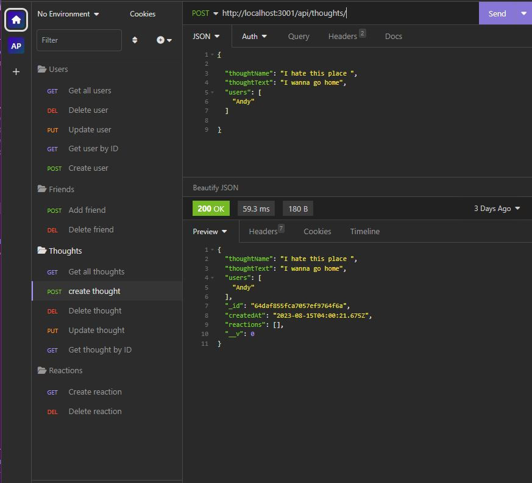
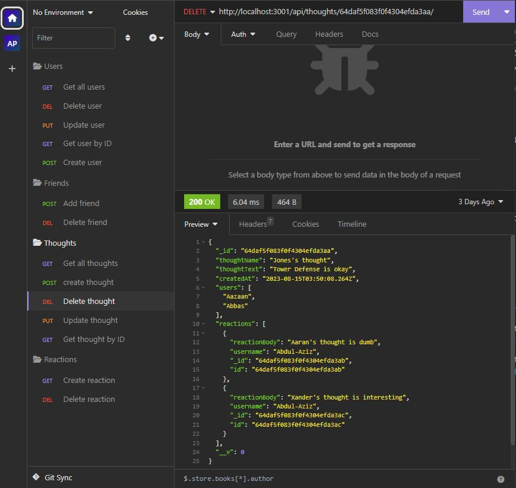
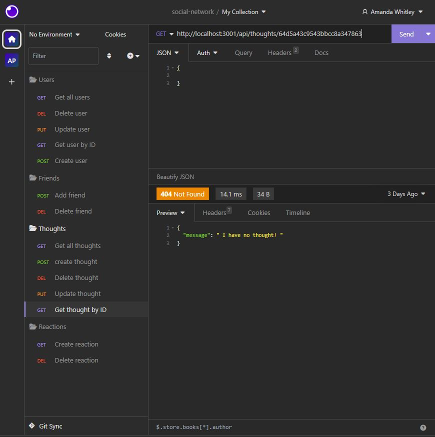
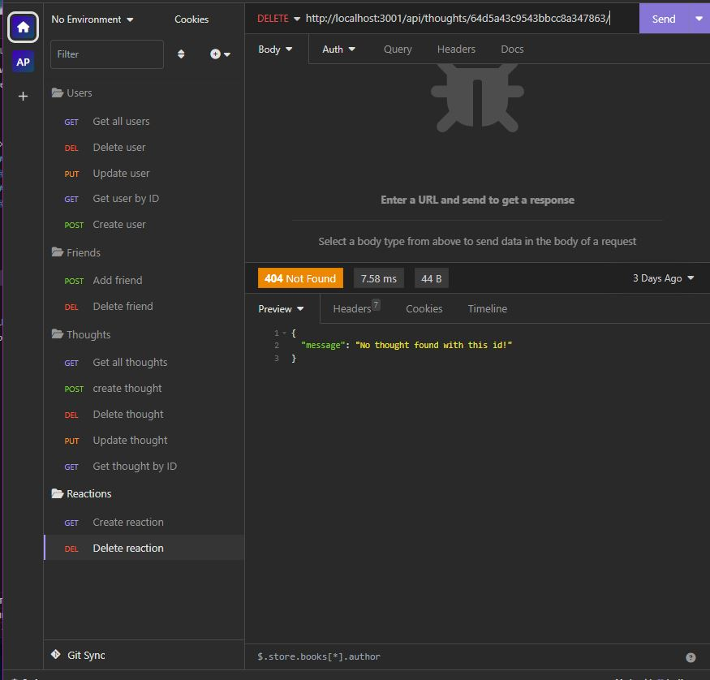
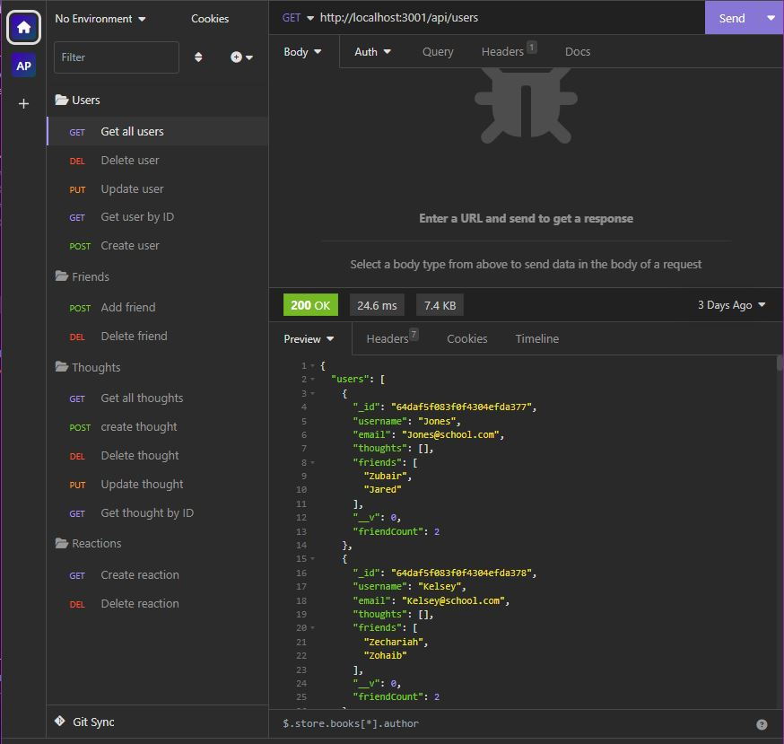

# social-network

### Name

Social Network

## Table of Contents 

* [Installation](#installation)
* [Description](#description)
* [Link](#link)
* [Installation](#installation)
* [Usage](#usage)
* [Contribute](#contribute)
* [Tested](#tested)
* [Questions](#questions)

![Demo] https://drive.google.com/file/d/1F6SLlBrx8N4U_M6nUdMGzP_rLMlGIA-L/view?usp=sharing 

    

    
### Description
    
The goal of this project was to use a NoSql database network to handle large amounts  of unstructured data. 
    
### Link

https://opensource.org/license/mit-0/

### Installation

node index

### Usage

insomnia

### Contribute

email

### Tested

milestones

### Questions

If you have any questions about the repo, open an issue or contact me directly at ajwhitey@comcast.net. You can find more of my work at [Pandax19](https://github.com/Pandax19/).

### Section 

Copyright 2023 MIT

    Permission is hereby granted, free of charge, to any person obtaining a copy of this software and associated documentation files (the “Software”), to deal in the Software without restriction, including without limitation the rights to use, copy, modify, merge, publish, distribute, sublicense, and/or sell copies of the Software, and to permit persons to whom the Software is furnished to do so, subject to the following conditions:
    
    The above copyright notice and this permission notice shall be included in all copies or substantial portions of the Software.
    
    THE SOFTWARE IS PROVIDED “AS IS”, WITHOUT WARRANTY OF ANY KIND, EXPRESS OR IMPLIED, INCLUDING BUT NOT LIMITED TO THE WARRANTIES OF MERCHANTABILITY, FITNESS FOR A PARTICULAR PURPOSE AND NONINFRINGEMENT. IN NO EVENT SHALL THE AUTHORS OR COPYRIGHT HOLDERS BE LIABLE FOR ANY CLAIM, DAMAGES OR OTHER LIABILITY, WHETHER IN AN ACTION OF CONTRACT, TORT OR OTHERWISE, ARISING FROM, OUT OF OR IN CONNECTION WITH THE SOFTWARE OR THE USE OR OTHER DEALINGS IN THE SOFTWARE.
 